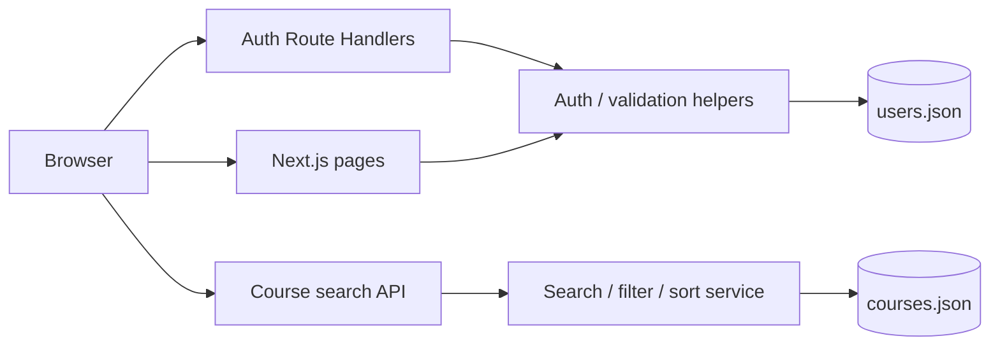

# Learniee Parent Dashboard

A small full-stack ed-tech assignment built with **Next.js, React, TypeScript and Tailwind CSS**. Parents can create an account, sign in, access a protected dashboard, and search/filter a local course catalog.

## What is included

- Real sign-up, login and logout flow.
- Passwords hashed with Node.js `scrypt`; plaintext passwords are never stored.
- Signed, HTTP-only session cookie with a 7-day expiry.
- Protected `/dashboard` route (server-side session validation + redirect).
- Parent dashboard showing the logged-in user's name/email.
- Course search by course name, subject or teacher.
- Combinable filters: grade, subject, min/max price and teacher rating.
- Sorting by recommended, rating and price.
- Pagination once results exceed the page size.
- Polished loading, empty and error states.
- Responsive UI for mobile, tablet and desktop.
- Course details modal for a fuller browsing experience.
- JSON-backed storage, so no hosted database is required for the assignment.
- Docker setup with Next.js standalone output, non-root runtime user and a health check for production-friendly deployments.

## Tech stack

- **Next.js 16.3 (App Router)** for the frontend and backend Route Handlers.
- **React 19 + TypeScript** for UI and type safety.
- **Tailwind CSS 4.3** for styling.
- **Node.js `crypto`** for password hashing and signed sessions.
- **Local JSON** for users and course data.

## Architecture



The UI never reads the user JSON file directly. Authentication, session validation and course filtering remain server-side; the client receives only public user fields and paginated course results.

## Project structure

```text
learniee-parent-dashboard/
├── app/
│   ├── api/
│   │   ├── auth/
│   │   │   ├── login/route.ts
│   │   │   ├── logout/route.ts
│   │   │   └── signup/route.ts
│   │   ├── courses/route.ts
│   │   └── health/route.ts
│   ├── dashboard/page.tsx
│   ├── login/page.tsx
│   ├── signup/page.tsx
│   ├── globals.css
│   ├── layout.tsx
│   └── page.tsx
├── components/
│   ├── dashboard/
│   │   ├── CourseCard.tsx
│   │   ├── DashboardClient.tsx
│   │   └── DashboardHeader.tsx
│   ├── AuthShell.tsx
│   ├── Brand.tsx
│   ├── LoginForm.tsx
│   └── SignupForm.tsx
├── data/
│   ├── courses.json
│   └── users.json
├── lib/
│   ├── auth.ts
│   ├── course-search.ts
│   ├── security.ts
│   ├── storage.ts
│   ├── types.ts
│   └── validation.ts
├── public/favicon.svg
├── .env.example
├── Dockerfile
├── docker-compose.yml
└── package.json
```

## Local setup

### 1. Requirements

- Node.js 20.9+
- npm 10+

### 2. Install

```bash
npm install
```

### 3. Configure environment

```bash
cp .env.example .env.local
```

Set a strong `AUTH_SECRET` in `.env.local`.

Generate one quickly with:

```bash
node -e "console.log(require('crypto').randomBytes(32).toString('hex'))"
```

### 4. Run

```bash
npm run dev
```

Open `http://localhost:3000`, create an account, and you will be redirected to the protected dashboard.

## Useful commands

```bash
npm run dev        # start development server
npm run typecheck  # TypeScript validation
npm run lint       # Next.js lint checks
npm run build      # production build
npm start          # run production server after build
```

## Data storage

This assignment intentionally uses local JSON because the brief says a hosted database is not required.

### Course data

Course catalog data lives at:

```text
data/courses.json
```

It is treated as read-only application data. The `/api/courses` Route Handler applies search, filters, sorting and pagination on the server.

Example course row:

```json
{
  "id": "course-01",
  "title": "Algebra Foundations",
  "subject": "Mathematics",
  "grade": "Grade 6",
  "price": 872,
  "rating": 4.9,
  "reviews": 63,
  "teacher": "Rohan Iyer",
  "durationWeeks": 7,
  "schedule": "Sun · 4:00 PM",
  "level": "Intermediate",
  "description": "Concept-first lessons, visual practice and guided problem solving that build accuracy and confidence.",
  "accent": "sky"
}
```

### User data

New users are stored in:

```text
data/users.json
```

For production-like deployments, set `DATA_DIR` to a mounted persistent directory. Only the user store uses `DATA_DIR`; the course catalog remains bundled with the app.

Example stored user row (the password hash below is illustrative):

```json
{
  "id": "2ea6332d-ff2a-4f8c-8231-b2d57bbbedab",
  "name": "Aarav Sharma",
  "email": "aarav@example.com",
  "passwordHash": "scrypt:<salt>:<derived-key>",
  "createdAt": "2026-08-18T10:00:00.000Z"
}
```

## Authentication design

1. Sign-up validates name, email and password.
2. The password is salted and hashed using `scrypt`.
3. A user record is written to the JSON store using an atomic temp-file rename.
4. The server creates a signed session token containing the user ID and expiration time.
5. The token is stored in an **HTTP-only, SameSite=Lax** cookie. `Secure` is enabled in production.
6. Protected pages and the course API verify the signed session before serving data.
7. Logout clears the session cookie.

Auth POST routes also reject cross-origin requests by checking the `Origin` header when it is present.

## Health check

A lightweight public health endpoint is available at:

```text
GET /api/health
```

The Docker image uses this endpoint for its container health check.

## Course search API

Endpoint:

```text
GET /api/courses
```

Supported query parameters:

```text
q            course title, subject or teacher text search
grade        exact grade
subject      exact subject
minPrice     minimum course price
maxPrice     maximum course price
minRating    minimum teacher rating (0–5)
sort         recommended | rating-desc | price-asc | price-desc
page         1-based page number
pageSize     3–12, defaults to 6
```

Example:

```text
/api/courses?q=math&grade=Grade%206&maxPrice=2000&minRating=4.5&sort=rating-desc&page=1
```

## Deployment

### Docker (recommended for this assignment)

The project includes a multi-stage production `Dockerfile` using Next.js standalone output, plus a `docker-compose.yml` with a persistent named volume.

```bash
docker compose up --build
```

The app is then available on `http://localhost:3000`. The compose file sets `COOKIE_SECURE=false` only because this local production run uses plain HTTP.

For a cloud container host (Render, Railway, Fly.io, a VPS, etc.):

1. Deploy this repository using the included Dockerfile.
2. Set `AUTH_SECRET` to a long random production secret.
3. Keep `COOKIE_SECURE=true` (or omit it) when the deployment is served over HTTPS.
4. Create/mount a persistent volume (for example at `/data`).
5. Set `DATA_DIR=/data`.
6. Expose port `3000` (or let the platform inject `PORT`; Next.js respects it through `npm start`).

### Important Vercel note

The app itself is Next.js-compatible, but this assignment's **writable local JSON user store is not a good fit for serverless read-only filesystems**. For a Vercel deployment, replace `lib/storage.ts` with a persistent database/KV adapter (for example Postgres) while keeping the auth/search UI unchanged.

## Assumptions made from the brief

- Actual course booking/payment was not listed in the required deliverables, so this build focuses on the requested auth, dashboard and course-search experience. Course cards provide a working details modal rather than pretending to complete a booking.
- Teacher rating is represented by the course's aggregated `rating` field.
- Prices are shown in INR because Learniee appears to be an India-focused assignment context; changing currency formatting is isolated to the UI.
- Pagination uses six courses per page so the pagination requirement is easy to demonstrate with the bundled catalog.

## Best-practice choices

- Server-only password hashing and session signing.
- No plaintext passwords or auth tokens in browser storage.
- Generic login errors to avoid exposing whether an email exists.
- Atomic JSON writes (`.tmp` + rename) and a small in-process write queue.
- Same-origin check on state-changing auth endpoints.
- Server-side route protection instead of relying only on client redirects.
- Search API validates, clamps and defaults numeric query parameters.
- Abortable/debounced course requests to avoid stale UI updates.
- Accessible labels, focus states, dialog semantics and responsive layouts.
- TypeScript strict mode and explicit shared types.
- Environment-driven production secret and user-data path.

## What I would improve with more time

1. Move users to Postgres/SQLite with migrations and unique constraints. JSON is suitable for this assignment but not for concurrent production traffic.
2. Add rate limiting and lockout/backoff on login/sign-up endpoints.
3. Add CSRF tokens for a broader threat model, plus security headers/CSP.
4. Add email verification, password reset and optional social login.
5. Add Playwright end-to-end tests for sign-up → dashboard → filters → logout.
6. Add unit tests for search/filter sorting and auth token verification.
7. Persist saved/favourite courses and implement a real booking flow.
8. Add admin tooling to manage courses instead of editing JSON manually.
9. Replace the in-memory course cache when dynamic course editing is introduced.
10. Add observability (structured logs, error reporting and request metrics).

## Assignment checklist

- [x] Real working login/sign-up
- [x] Logged-in protected dashboard
- [x] Logged-in user info visible
- [x] Clean, polished and responsive UI
- [x] Course name/subject search
- [x] Grade filter
- [x] Subject filter
- [x] Price range filter
- [x] Teacher rating filter
- [x] Combinable filters
- [x] Price/rating sorting
- [x] Pagination
- [x] “No results” state
- [x] Local JSON storage
- [x] README with storage details + example row
- [x] Deployment documentation

## Submission

For the assignment, submit:

1. GitHub repository URL.
2. Live deployed URL (Docker/container host recommended if you want sign-ups to persist).
3. This README.
